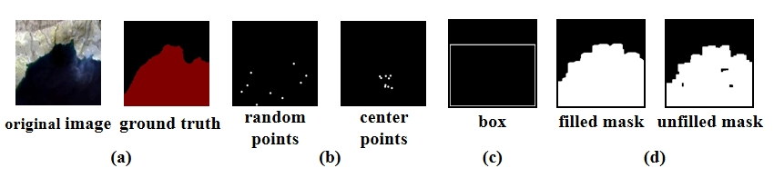

# High-Fidelity Lake Extraction via Two-Stage Prompt Enhancement: Establishing a Novel Baseline and Benchmark

<p align="center">
    
</p>

Figure 1: Visualization images of the prompt dataset for lake extraction. (a) Example images of the original image and ground truth. (b) Example images depicting two types of point prompts: random points and center points. (c) Example images illustrating box prompt. (d) Example images showcasing two types of mask prompts: filled mask and unfilled .

<p align="center">
    
</p>

Figure 2: Overview architecture of LEPrompter with three main modules. (a) A prompt dataset that contains prior information. (b) A lightweight prompt encoder that extracts strong prior prompt information features. (c) A lightweight prompt decoder that fuses the prompt tokens from the prompt encoder and the image embedding from the Vision Image Encoder.

The repository contains official PyTorch implementations of training and evaluation codes and pre-trained models for **LEPrompter**.

The code is based on [MMSegmentaion v0.30.0](https://github.com/open-mmlab/MMSegmentation/tree/v0.30.0).

## Installation

For install and data preparation, please refer to the guidelines in [MMSegmentation v0.30.0](https://github.com/open-mmlab/mmsegmentation/tree/v0.30.0).

An example (works for me): ```CUDA 11.6``` and  ```pytorch 1.11.0``` 

```
pip install -U openmim
mim install mmcv-full
cd LEFormer && pip install -e . --user
```

## Pretrained Weights
Due to the size limitation of 20MB for the Supplementary Material, we are currently unable to provide the pretrained weights. After the paper has been accepted, we will make the download links for the pretrained weights available.


## Datasets Preparation

### Split Dataset 

The original SW dataset is freely available for download [here](https://aistudio.baidu.com/aistudio/datasetdetail/75148).

The original QTPL dataset is freely available for download [here](http://www.ncdc.ac.cn/portal/metadata/b4d9fb27-ec93-433d-893a-2689379a3fc0).  

The original CVC-ClinicDB dataset is freely available for download [here](https://polyp.grand-challenge.org/CVCClinicDB/).  

The original ISIC2018 dataset is freely available for download [here](https://challenge.isic-archive.com/data/#2018).

Example: split ```Surface Water```:
```python
python tools/data_split.py --dataset_type sw --dataset_path /path/to/your/surface_water/train_data --save_path /path/to/save/dataset
```

### Create Prompt Dataset

The structure of prompt datasets are aligned as follows:
```
SW or QTPL prompt dataset
├── annotations
│   ├── training 
│   └── validation 
├── binary_annotations
│   ├── training 
│   └── validation 
├── images  
│   ├── training 
│   └── validation 
└── prompts  
    └── training  
```

Example: create ```Surface Water Prompt Dataset```:
```python
python tools/gen_prompt_datasets.py --dataset_path /path/to/your/surface_water/
```

## Training

We use 1 GPU for training by default. Make sure you have modified the `data_root` variable in [prompt_sw_256x256.py](local_configs/_base_/datasets/prompt_sw_256x256.py) or [prompt_qtpl_256x256.py](local_configs/_base_/datasets/prompt_qtpl_256x256.py).    

Example: train ```LEPrompter``` on ```Surface Water Prompt Dataset```:

```python
python tools/train.py local_configs/leprompter/leprompter_256x256_sw_160k.py
```

## Evaluation
To evaluate the model. Make sure you have modified the `data_root` variable in [sw_256x256.py](configs/_base_/datasets/sw_256x256.py) or [qtpl_256x256.py](configs/_base_/datasets/qtpl_256x256.py).  

Example: evaluate ```LEFormer``` on ```Surface Water Dataset```:

```python
python tools/test.py configs/leformer/leformer_256x256_sw_160k.py /path/to/your/pretrained_model --eval mIoU mFscore
```